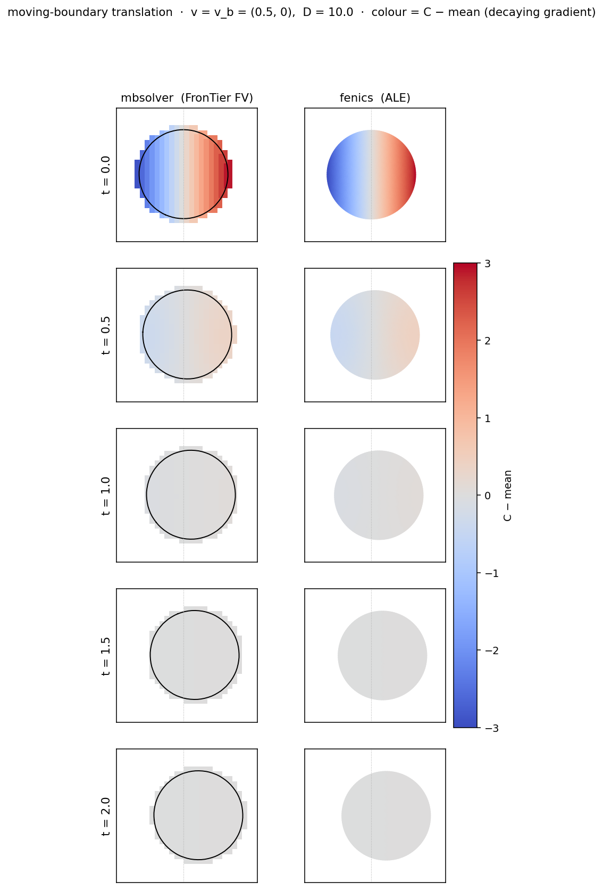

# FV ↔ FEniCSx cross-validation

End-to-end numerics comparison of VCell's finite-volume solver against this repo's FEniCSx
backend, on a **common VCML** both solvers consume. This is the §"comparison baseline" milestone:
the same authored model is run by VCell's FV solver (ground truth) and imported + realized + solved
through `vcell_fenics`, then compared point-by-point on the FV solver's own grid.

## The models

Single 2D diffusing species `u` on the box `[-1, 1]²`, no-flux boundaries (mass conserved), with a
spatially non-uniform (off-centre Gaussian) initial condition:

| stem  | initial condition          | reaction            |
|-------|----------------------------|---------------------|
| `v1`  | Gaussian, width `a = 0.02` | pure diffusion      |
| `v1b` | Gaussian, width `a = 0.05` | pure diffusion      |
| `v2`  | Gaussian, width `a = 0.02` | first-order decay `k = 0.5` |

`D = 0.1`, end time `1.0`, 11 output times, FV mesh `128 × 128`.

## Two-stage flow (two environments)

The two solvers live in different environments (the dependency boundary: libvcell + fvsolver stay
out of the DOLFINx env), so the comparison is two stages:

1. **Author + run FV** — `author_and_run.py`, in the pyvcell `[native,solver]` env. Authors the
   biomodel, runs VCell's FV solver, and writes next to each model:
   - `<stem>.vcml` — the exact VCML the FV solver consumed;
   - `<stem>_math.yaml` / `<stem>_geom.yaml` — the lowered MathDescription / Geometry (what our
     bridge imports), extracted from the VCML via `VcmlReader`;
   - `<stem>_reference.npz` — the 4D FV field `u(t, c, y, x)` on the solver's grid, plus the
     free-space analytic reference. **Not committed** (large, ~2.4 MB each) — regenerate with
     `../pyvcell/.venv/bin/python cross_validation/author_and_run.py`.

2. **Import + solve + compare** — `compare_fenics_vs_fv.py`, in the vcell-fenics **dev** env.
   Imports the same lowered math + geometry, realizes the box, solves through our backend, samples
   `u_h` at the FV grid points, and reports relative-L2 agreement per output time plus mass.

```bash
../pyvcell/.venv/bin/python  cross_validation/author_and_run.py            # stage 1 (regenerates .npz)
.pixi/envs/dev/bin/python    cross_validation/compare_fenics_vs_fv.py      # stage 2 (needs the .npz)
```

## Result

We solve with the **method-of-lines** integrator (PETSc TS adaptive BDF), the same strategy as the FV
solver's Sundials/CVODE, so the time error is ≈0 and the comparison isolates the spatial
discretisation. The two independent solvers then agree to **~0.1–0.3 % relative L2** at every output
time (v1/v1b/v2; tightening as the field smooths) — the spatial floor. Both reflect mass at the walls,
so each diverges from the *free-space* analytic only once the front reaches the boundary (relL2 → ~14 %
by `t = 1`) — an expected physical difference, not solver error. `v2`'s total mass decays
`0.628 → 0.384 ≈ 0.628·e^(−0.5)` on both solvers, confirming the decay reaction rides correctly on top
of diffusion. (With backward Euler the difference was up to ~2 %, dominated by *our* time step — see
the convergence study below.)

## 3D single-species diffusion

The 3D analog of the diffusion family (`diffusion_3d_fv.py` + `compare_3d.py`), the first case built on
the Netgen 3D `realize` + dimension-generic solvers. Single species `u` on the box `[-1, 1]³`, **no-flux
(zero-Neumann) on all six faces** (VCell `type: Flux`; our import yields `boundary_conditions: []` → the
natural zero-Neumann — a *closed, mass-conserving* system, not a Dirichlet reference), off-centre Gaussian
IC (σ = 0.15), `D = 0.1`, FV mesh `32³`.

```bash
../pyvcell/.venv/bin/python cross_validation/diffusion_3d_fv.py   # stage 1 (FV reference .npz)
.pixi/envs/dev/bin/python   cross_validation/compare_3d.py        # stage 2 (h-refinement compare)
```

`compare_3d.py` **refines the FEniCSx box** `h = 0.1 → 0.05 → 0.025` (20³→40³→80³) and reports **both L2
and L∞** (L∞ exposes localized peak error L2 averages away). The exact free-space Gaussian is only a
*comparison reference*, used at `t = 0` where it equals the true IC (the Gaussian is ~5σ from every wall,
so free-space ≡ no-flux there); the cross-solver check uses **FV at t = 0.5** (both bounded, both reflect
identically). The box is a structured whole-box mesh — geometry exact at every h.

| h | box | IC relL2(an) | IC relL∞(an) | order(L∞) | relL2(FV) | relL∞(FV) | mass drift |
|---|-----|--------------|--------------|-----------|-----------|-----------|------------|
| 0.100 | 20³ | 8.07 % | 12.49 % | — | 4.98 % | 8.33 % | 1e-13 |
| 0.050 | 40³ | 2.17 % | 3.42 % | 1.87 | 1.71 % | 3.12 % | 6e-14 |
| 0.025 | 80³ | 0.54 % | 0.87 % | 1.99 | 0.86 % | 1.65 % | 2e-12 |

The IC error converges at **order ≈ 2 in both L2 and L∞** (P1 interpolation) — L∞ matching L2 confirms no
hidden localized error; the peak resolves at the same rate. FEM↔FV agreement tightens to **~0.9 % L2 /
~1.7 % L∞** by 80³ (the fixed FV-32³ floor). **Both solvers conserve mass exactly**: our FEM to round-off
(~1e-13 at every h), and FV likewise. (An apparent **+4 % FV "drift" was a quadrature artifact on our
side**, not the solver. VCell's FV is cell-centered, but its output degrees of freedom live *on* the domain
boundary with **fractional control volumes** — ½ on faces, ¼ on edges, ⅛ on corners — so integrating the
field with a uniform `dx³` weight over-counts the boundary DOFs; as the Gaussian spreads into them the sum
inflates, with the entire "gain" sitting in the boundary shell while the interior drops. **Trapezoidal**
integration — precisely that fractional boundary weighting — gives **−0.000 % drift**, confirming exact FV
conservation.) Against the *free-space* analytic at late times the fields diverge ~24 % L∞ by `t = 1` — the
expected **wall-reflection** artifact of the bounded no-flux domain, not solver error.

## 3D interface-coupled permeability

`coupled_3d_fv.py` + `compare_coupled_3d.py` — the 3D analog of the 2D permeability coupling, on the new
Netgen 3D `realize_interface_coupled` + 3D `integrate_interface_coupled`. A spherical `cyto` (radius 0.5)
in an `ext` background on `[-1,1]³`, two bulk species (`s_cyto` init 1, `s_ext` init 0) coupled by a
membrane permeability flux `J = P·(s_ext − s_cyto)` (P = 0.5, D = 1). VCell's jump conditions route to the
equal-and-opposite pair of single-sided `BCInterfaceFlux` our coupled integrator solves — geometry *and*
physics both come from the import pipeline. FV at 32³/48³; the FEniCSx side refines `h` alongside.

```bash
../pyvcell/.venv/bin/python cross_validation/coupled_3d_fv.py
.pixi/envs/dev/bin/python   cross_validation/compare_coupled_3d.py
```

We sample `s_cyto` inside the sphere and `s_ext` outside (skipping the membrane band) at the FV grid
points and report L2/L∞ vs the FV-48³ reference at `t = 1` (mid-transient, the means still apart):

| h | inner+outer tets | relL2(FV) | relL∞(FV) | ratio | s_cyto(FEM) | s_ext(FEM) | mass drift |
|---|------------------|-----------|-----------|-------|-------------|------------|------------|
| 0.100 | 24 954 | 2.76 % | 4.60 % | — | 0.1203 | 0.0595 | 4e-13 |
| 0.067 | 56 726 | 1.74 % | 2.96 % | 1.58× | 0.1221 | 0.0600 | 1e-13 |
| 0.050 | 136 800 | 1.07 % | 2.16 % | 1.63× | 0.1231 | 0.0605 | 2e-12 |

relL2 falls **first-order** (~1.6×/step — the membrane coupling is 1st-order on each side, matching the 2D
case), and both compartment means converge toward the FV values (`s_cyto → 0.1258`, `s_ext → 0.0609`).
**Total substance is conserved to round-off (~1e-13) at every h** — measured against the *realized* cyto
volume, which isolates the solver's exact conservation from the faceted-sphere geometry error (the earlier
~3 % "drift" against the analytic `4/3πr³` was purely that geometry gap, and it shrinks as the sphere
resolves with h).

## 3D membrane surface-species (receptor)

`receptor_3d_fv.py` + `compare_membrane_3d.py` — a membrane **surface species** cross-validation on the 3D
`integrate_membrane_coupled`. A spherical `cyto` in an `ext` background on `[-1,1]³`, two bulk ligands
`s_cyto`/`s_ext` (both init 1) captured by a membrane receptor `R` (a `surface_pde_with_dilution` species)
via two saturating binding reactions `kon·ligand·(Rmax − R)`. VCell lowers these to a membrane PDE for R
plus the jump conditions that deplete the ligands; geometry + math are imported, realized in 3D, and
solved. FV at 32³/48³.

```bash
../pyvcell/.venv/bin/python cross_validation/receptor_3d_fv.py
.pixi/envs/dev/bin/python   cross_validation/compare_membrane_3d.py
```

We compare the depleted ligand fields (R acts on them through binding) vs the FV-48³ reference at `t = 2`,
refining `h` alongside:

| h | relL2(FV) | relL∞(FV) | ratio | s_cyto(FEM) | s_ext(FEM) | bound R | mass drift |
|---|-----------|-----------|-------|-------------|------------|---------|------------|
| 0.100 | 0.119 % | 0.560 % | — | 0.6744 | 0.9739 | 218.6 | 9e-15 |
| 0.067 | 0.088 % | 0.415 % | 1.35× | 0.6757 | 0.9737 | 219.9 | 8e-15 |
| 0.050 | 0.070 % | 0.332 % | 1.26× | 0.6765 | 0.9736 | 221.0 | 3e-15 |

**Sub-0.1 % relL2** agreement (converging), with the depleted ligand means matching FV (`s_cyto → 0.6796`,
`s_ext → 0.9736`) and the receptor capturing ligand (bound R grows 0 → ~220, itself converging with h). That
tight ligand match is the end-to-end validation of the **surface PDE + binding on the 2D-in-3D membrane** —
our R-depleted ligands match FV's to <0.1 %.

**Total substance is conserved once the units are reconciled.** The membrane receptor R (density,
molecules·µm⁻²) and the volume ligands (µM) live in different units; the conserved quantity is
`∫s_cyto dV + ∫s_ext dV + KMOLE·∫R dA`, with **KMOLE ≈ 1/602.214** (the µmol↔molecules factor, pulled from
the imported parameters — no hard-coding). That total is flat to **round-off (~1e-14) at every h**, and the
free-ligand loss equals `KMOLE·(bound R gained)` exactly (verified: 0.36302 = 0.36302). A raw `total_mass()`
that sums R with the volume ligands mixes units and is *not* the conserved quantity (it read a spurious 27×).

## 3D reaction-advection-diffusion

`advection_3d_fv.py` + `compare_3d_advection.py` — the 3D diffusion case plus a prescribed advection
velocity `v = (0.4, 0, 0)` on the species (set on `SpeciesMapping.velocity_x` → the lowered PDE `velocity`
slot → our `relative_advection`; `run()` solves it with no special handling). A Gaussian (σ = 0.12,
D = 0.03) started near the `-x` wall advects across the interior; no-flux boundaries, FV mesh `32³`.

```bash
../pyvcell/.venv/bin/python cross_validation/advection_3d_fv.py
.pixi/envs/dev/bin/python   cross_validation/compare_3d_advection.py
```

Both solvers advect the bump at exactly `v`: FV centre-of-mass `x: −0.5 → −0.3` at `t = 0.5`
(`Δ = v_x·t = 0.2`), and FEM reaches `−0.303` at every h — the field advects at the prescribed velocity.
h-refinement:

| h | box | IC relL2(an) | IC relL∞(an) | order(L∞) | relL2(FV) | relL∞(FV) | mass drift |
|---|-----|--------------|--------------|-----------|-----------|-----------|------------|
| 0.100 | 20³ | 12.49 % | 17.47 % | — | 11.07 % | 17.81 % | 1.5e-3 |
| 0.050 | 40³ | 3.56 % | 5.62 % | 1.64 | 4.47 % | 7.34 % | 2.9e-3 |
| 0.025 | 80³ | 0.87 % | 1.34 % | 2.07 | 2.94 % | 4.54 % | 3.2e-3 |

The IC error converges at **order ≈ 2** (L2 and L∞); FEM↔FV tightens to **~2.9 % L2 / ~4.5 % L∞** by 80³ —
coarser than the pure-diffusion floor (~0.9 %), as expected since the advected bump is sharper and both
schemes carry advection (numerical-diffusion / dispersion) error. Here **L∞ (4.5 %) meaningfully exceeds
L2 (2.9 %)** — the error concentrates on the bump's moving edges, which L2 averages away. And unlike pure
diffusion (mass exact), the FEM mass drifts **~0.1–0.3 %**: the solver's **advective** form `v·∇c`
conserves mass only up to the boundary term `∫_∂Ω (v·n) c ds` (nonzero on the outflow face), small while
the bump stays interior — the conservative form would remove it. A worthwhile note for the
mass-conservation axis of the fvsolver comparison.

## Membrane jump-condition sign convention

`membrane_flux_sign.py` (pyvcell `[native,solver]` env) confirms the **sign** of the membrane
jump-condition → Neumann mapping against the FV solver, on a two-compartment cell (inner-disk
`cytosol` + `background` extracellular, `membrane` between them), in both directions:

| case   | reaction                          | VCell `in_flux(u)`   | FV cytosol mass |
|--------|-----------------------------------|----------------------|-----------------|
| efflux | mass-action `u → ∅` (`Kf·u`)      | negative (`∝ Kf·u`)  | decreases       |
| influx | general-kinetics `∅ → u` (`J=0.5`)| positive (constant)  | increases       |

The bridge maps `in_flux` **directly** (no sign flip) to `BCNeumann(u, membrane, in_flux)`, and the
backend's Neumann sign is independently verified (`d(mass)/dt = ∫_Γ h ds`). Both FV directions match
the sign of `in_flux`, so the convention is correct (locked in the dev env by
`tests/test_pyvcell_bridge.py::test_jump_condition_preserves_vcell_flux_sign`). A constant membrane
source needs **general kinetics** (the net rate set directly) — mass-action gives an empty reactant
product a rate of 0, so a reactant-less `∅ → u` is silently inert.

A full multi-compartment numerical FV-vs-ours *field* comparison would additionally need the backend
to apply a one-sided flux on an internal interface (solve one compartment's submesh with the membrane
as its boundary) — a later increment; this check confirms the sign at the import boundary.

## Convergence study — is the ~2 % a bug or discretization?

`convergence_fv.py` (FV at 64²/128²/256²) + `convergence_study.py` (dev env) check that the FV↔FEniCSx
difference is discretization, not a hidden bug — and surfaced one. The FV solver uses MOL (≈0 time
error); our comparison scripts use **backward Euler**, a first-order time error.

- **Time-error isolation** (FV 128², fixed mesh, t=0.5): relL2(FEM,FV) falls `1.46 % → 0.69 % → 0.30 %
  → 0.11 %` as `dt` halves `0.02 → 0.0025` — first-order, heading to 0. Most of the original ~2 % was
  *our backward-Euler time step*, not a spatial mismatch.
- **Joint refinement** (small-`dt` BE, `h = 2/N`): relL2(FEM,FV) stays ~0.1–0.2 %, while FEM and FV
  *each* differ from the **free-space analytic** by ~5 % (at t=0.5) — by nearly identical amounts. That
  gap is **wall reflection** (bounded domain vs infinite-domain analytic), physics both solvers
  capture. The two solvers agree with each other 30–50× better than with the analytic ⇒ no hidden bug.
- **MOL bug found here, fixed:** our method-of-lines integrator (PETSc `TSBDF`) over-diffused by a
  constant effective-time offset ≈ the *initial* step (`dt_initial=0.05 → eff t 0.555`; target 0.5) — a
  **BDF order-1 cold-start** error the adaptive controller does not catch (tightening `rtol` does
  nothing; Crank–Nicolson is correct; `final_time` is exact, so not an overshoot). **Fixed** by a small
  default startup step (`t_final/1e4`) and by `run()` no longer forwarding the backward-Euler-sized
  `config.dt` as the seed: MOL now lands on `t_final` (eff t `0.5008`) and is the *most* accurate
  integrator (0.10 % vs FV-128, beating backward Euler's time error). Regression:
  `test_backend_reaction_diffusion.py::test_bdf_cold_start_does_not_over_diffuse`.

## Time-dependent membrane flux (field comparison)

`membrane_timeflux_fv.py` (stage 1, pyvcell env) + `compare_membrane_timeflux.py` (stage 2, dev env)
cross-validate a **time-dependent** membrane flux — the case that exercises the backend's `sim.t` path
end-to-end (a `g(t)` Neumann re-evaluated each step). Same cell, with a general-kinetics membrane
influx whose net rate is an explicit function of time, `J(t) = 100·exp(−2t)`. The flux depends only on
`t`, so the cytosol PDE decouples from the extracellular and the membrane is the whole cytosol-disk
boundary: stage 2 imports the real lowered math, reduces it to the cytosol (the membrane survives as
the disk's external boundary carrying the imported `BCNeumann(u, membrane_dom, g(t))`), and solves on
a single-compartment disk.

Result (method-of-lines): **0.16–0.70 % relL2** against the FV cytosol field at every output time
(tightening to ~0.16 % as the transient settles), with mass tracking to ~0.1 %; the mass-rise rate
slows over time exactly as `J` decays — the time signature. The VCell unit factors (`KFlux`,
`UnitFactor = KMOLE`, reconciling membrane molecules·µm⁻² ↔ volume µM) are carried as parameters, so
our applied Neumann matches FV in **magnitude** as well as sign. This needed the backend to bind a
`ParameterExpression` (those unit factors are `Area/Volume`, `pow(KMOLE,1)`, not bare constants) —
`test_backend_assemble.py::test_expression_parameter_binds_against_constants`.

### Through the real multi-compartment pipeline + convergence

The disk reduction above sidesteps the membrane geometry. The same model now also solves through the
**real** pipeline — import → `normalize_to_geometry_frame` → realize (multi-compartment: cytosol +
extracellular + membrane) → run — with the membrane flux applied as a *one-sided* Neumann on the
cytosol submesh boundary (the membrane is an internal interface; its facets are re-located onto the
submesh). `membrane_convergence_fv.py` runs the FV solver at **64²…1024²** and `membrane_convergence.py`
refines the FEniCSx mesh alongside (realize resamples the faceted membrane at the mesh scale). Comparing
to a *single* FV grid can't show convergence — its 1st-order membrane error is the floor — so we refine
both:

| N | relL2(FEM, FV-N) | ratio |
|------|------|------|
| 64   | 1.73 % | — |
| 128  | 0.94 % | 1.84× |
| 256  | 0.47 % | 2.01× |
| 512  | 0.36 % | 1.31× |
| 1024 | 0.10 % | 3.44× |

~2.0×/level on average (first-order, as both the FV stairstep and our body-fitted polygon membrane are
O(h)), ending at **0.10 %** — the membrane solve converges to the FV solution, no hidden bug. The 512
dip → 1024 recovery is grid/membrane-alignment noise: a 3-level sweep would misread it as a plateau,
which is why the study runs **five** levels. The flux magnitude is independently exact — the total
cytosol mass converges to the analytic `(perimeter)·∫g`.

## Cross-compartment coupling (permeability flux, MOL on both solvers)

`coupled_perm_fv.py` + `coupled_perm_convergence.py` are the definitive cross-solver check for the
**bulk-bulk interface coupling** (`integrate_interface_coupled`). A disk-in-box cell with species
`s_cyto` in the disk and `s_ext` in the surrounding box, coupled by a membrane **permeability flux**
`J = P·(s_ext − s_cyto)` (a VCell flux reaction → an equal-and-opposite pair of single-sided interface
fluxes the coupled integrator solves; unit factor 1, so `P` maps straight across).

This runs the **fully imported pipeline** — the FEniCSx side imports VCell's *same* geometry **and
math** (`import_geometry` + `import_math_description`, where the coupled jump-condition pair routes to a
pair of single-sided `BCInterfaceFlux`) → `normalize_to_geometry_frame` → `realize_interface_coupled`, with no
hand-built parallel mesh or hand-written physics — and solves with the coupled method-of-lines
integrator (PETSc TS, GMRES+ILU). Both solvers use MOL (≈0 time error), so refining both grids isolates
the spatial discretization:

| N | h | relL2(FEM, FV-N) | ratio |
|------|------|------|------|
| 64 | 0.031 | 1.63 % | — |
| 128 | 0.016 | 0.64 % | 2.55× |
| 256 | 0.008 | 0.35 % | 1.82× |

~2×/level (first-order — the membrane is O(h) on each side: FV's stairstep and our body-fitted
polygon) → the coupled solver converges to the FV solution, no hidden bug.

**Scalability note.** The coupled MOL inner solve uses **GMRES + ILU** (scalable, like the single-mesh
MOL and VCell's CVODE), not a direct LU — a direct sparse LU's 2D fill-in does not scale and made 256²
hang. Even so, the body-fitted realize + coupled block solve cap the FEniCSx side at ~256² (~170k
cells, ~5 min) here, where 512² is cheap for the FV grid; 3D would need AMG + MPI + AMR.

## Membrane species coupled to both bulks (receptor binding, matrix-free MOL)

`receptor_fv.py` + `receptor_convergence.py` are the cross-solver check for the **three-region
membrane coupling** (`integrate_membrane_coupled`). The same disk-in-box cell, now with a membrane
receptor `R` (bound density) that captures ligand from *both* compartments via two saturating binding
reactions `kon·s·(Rmax − R)` (VCell membrane reactions: volume reactant → membrane product). VCell lowers
these to a membrane PDE for `R` plus the jump conditions that deplete the ligands, carrying the
volume↔membrane unit factors `KFlux·KMOLE` (`KMOLE ≈ 1/602`); the FEniCSx side imports that math
verbatim — the membrane reaction trace-wrapped, the jumps → `interface_flux`, the unit factors as
expression-valued parameters — so **both solvers solve VCell's identical math**, with no hand-written
physics. `Rmax`/`kon` are tuned so the ligands deplete visibly under `KMOLE` (else the bulk barely moves).

The membrane species' `∂(binding)/∂R` Jacobian block is un-assemblable in DOLFINx (a bulk-coefficient ×
membrane-trial term on the interface facet → 0), so `integrate_membrane_coupled` applies the implicit
Jacobian **matrix-free** (finite-differencing the conservative residual), preconditioned by the
assembled partial Jacobian. Comparing it to FV (Sundials/CVODE) under joint refinement at `t = 2`
(both ligands clearly depleted: `s_cyto ≈ 0.77`, `s_ext ≈ 0.94`):

| N | h | relL2(FEM, FV-N) | ratio |
|------|------|------|------|
| 64 | 0.031 | 0.118 % | — |
| 128 | 0.016 | 0.056 % | 2.09× |
| 256 | 0.008 | 0.028 % | 2.03× |

Clean ~2×/level (first-order — the body-fitted membrane is O(h) on each side) → the matrix-free
membrane-coupled MOL converges to VCell's fvsolver on a receptor-ligand model imported end-to-end.

## Moving-boundary translation (ALE ↔ FronTier FV)

A first cross-validation of a **moving boundary** against `../vcell-mbsolver` (the FronTier
front-tracking + conservative-Voronoi FV solver, now `pyvcell-mbsolver`; algorithm: Novak & Slepchenko,
*J. Comput. Phys.* 270, 2014). A disk of cytoplasm (radius 3) carrying an interior species `C`
(`D = 10`, IC `C = x`) is translated rigidly at velocity `(0.5, 0)`; both solvers run it and we compare
the centre-of-mass trajectory and the `C` homogenisation to `t = 2`.

**The convention that makes them agree.** The mbsolver separates the **front** velocity `v_b` (moves the
boundary) from the **volume** velocity `v` (advects the species). For a migrating cell carrying its
cytoplasm, set `v = v_b`: then the parabolic equation is pure diffusion in the moving frame and the
Rankine–Hugoniot BC `(J − v_b u)·n = 0` reduces to no-flux — exactly our ALE `MotionPrescribedVelocity`.
Setting only the front (`v = 0`) instead sweeps a fixed lab-frame field (a traveling exponential), a
different problem — which is why an initial front-only run disagreed ~290× on the interior. (Driving the
species advection with a zero component surfaced a pyvcell writer bug, virtualcell/pyvcell#54.)

```bash
../pyvcell/.venv/bin/python  cross_validation/mb_translation_fv.py    # stage 1: FV reference + per-frame fields (gitignored, regenerable)
.pixi/envs/dev/bin/python    cross_validation/mb_translation.py       # stage 2a: fenics ALE + the comparison table
.pixi/envs/dev/bin/python    cross_validation/mb_translation_plot.py  # stage 2b: the tiled figure (mb_translation.png)
```

| t | fenics CoM Δx | FV front Δx | fenics C spread | FV C spread |
|---|---|---|---|---|
| 0.5 | 0.250 | 0.227 | 0.894 | 0.749 |
| 1.0 | 0.500 | 0.486 | 0.159 | 0.112 |
| 2.0 | **1.000** | **0.978** | **0.0050** | **0.0026** |

Both translate by ~1 (fenics exact ALE; FV 2.3 % short from front redistribution) and both interiors
homogenise — the solvers agree on the front motion and on diffusion-in-the-moving-frame.



The figure tiles the two solvers (rows = output times). Positions are recentred to a common start (the FV
domain places the cell at `(5, 5)`, the fenics disk at the origin) and the colour is `C − mean` — the
decaying gradient — since diffusion conserves the mean and the setups differ only by that offset. The
mbsolver shows the field on its square cut-cell FV grid (with the tracked front polygon), fenics on the
smooth moving ALE mesh; both start from the same `C = x` gradient, homogenise at the same rate, and drift
right of the dotted start line by ~1 at `t = 2`. (This mbsolver build's per-node `x`/`y` accessors return
the cell centroid, so the plot reconstructs node positions from the reliable integer grid indices,
calibrated against the front.)

The front velocity is now importable end-to-end: `pyvcell_bridge.import_model(..., front_velocity=...)`
maps an `app.front_velocity` (a single moving surface) to a `MotionPrescribedVelocity` on the surface's
interior compartment — so one VCML can drive both solvers. Next: chemistry-coupled front velocities (the
ALE backend evaluates only space/time motion today) and the *active-gel migration* model
(`docs/modeling/active-protrusion-migration.md`).

## Moving-boundary SWEPT — VCell's own semantics, through the SimulationTask path

The translation and expansion cases above use the Lagrangian convention (species velocity = front
velocity: the cell carries its cytoplasm). **VCell's default is different**. Its moving-boundary solver is
Eulerian: a fixed grid and an embedded moving front, with each species at its own lab-frame velocity (zero
unless the model sets one). The front then *sweeps* the species under the Rankine–Hugoniot condition
`(−D∇u + (v − v_b)u)·n = 0`: in the cell's frame they drift backwards and pile against the trailing
membrane. vcell-fenics solves that with the lab-frame `advection` slot, transporting relative to the mesh
(`v − w`). The ALE mesh velocity `w` is bookkeeping and does not enter the answer
(`tests/test_backend_lab_frame_advection.py`).

These cases run the **real VCell moving-boundary SimulationTask** (`tests/fixtures/simtask/SimID_274641196`:
a disk of radius 3 at (5, 5) in a 10 × 10 box, `C = x` and `Ran = y`, `D = 10`, no species velocity) through
the CLI path, the code VCell's cluster and desktop runs take. The reference is mbsolver on the same problem
authored in pyvcell. At each output time our P1 field is interpolated exactly, on that row's moved mesh, at
mbsolver's inside grid nodes. A **negative control** re-runs the task with the species *carried*
(lab velocity = front velocity), which shows the comparison separates the two conventions.

```bash
../pyvcell/.venv/bin/python  cross_validation/mb_swept_fv.py --case translate|deform|remesh [--mesh 61]   # stage 1
.pixi/envs/dev/bin/python    cross_validation/mb_swept.py    --case translate|deform|remesh [--h 0.16 --dt 0.005]
```

| case (front velocity) | mbsolver mesh / fenics h | relL2 (relL∞) at t = 1 | carried control | right edge: fenics / mbsolver / exact |
|---|---|---|---|---|
| translate `(sin t, cos t)` | 31 / 0.32 | **0.41 %** (0.69 %) | 13.8 % (22.6 %) | 8.464 / 8.454 / 8.460 |
| translate | 61 / 0.16 | **0.22 %** (0.34 %) | — | 8.461 / 8.458 / 8.460 |
| deform `(0.2(x−5)² − 1.2, 0)` | 31 / 0.32 | 2.70 % (4.69 %) | 13.3 % (18.6 %) | 9.237 / 9.103 / 9.253 |
| deform | 61 / 0.16 | 1.45 % (2.58 %) | — | 9.241 / 9.180 / 9.253 |
| remesh `(0.4(x−5)² − 3.4, 0)`, **1 remesh** | 31 / 0.32 | 7.4 % (19.4 %) | 38.1 % (60.7 %) | 8.887 / 8.292 / 8.922 |

- **Translation** agrees to 0.4 %, and **halves under refinement** of both solvers (0.41 → 0.22 %). The
  fronts and areas coincide (28.230 vs 28.180 at mesh 31). The carried convention is 14 % off, so the
  comparison discriminates by about 30×.
- **Deforming fronts:** on the x-axis the front's extremes follow `du/dt = a u² − b` exactly (`v_y = 0`).
  Ours stays within about 0.02 of that exact position, while mbsolver's lags on the fast-moving side, and the
  field difference shrinks as mbsolver's front converges (2.70 → 1.45 %). The remaining gap is mbsolver's
  front error, not ours.
- **Remeshing:** the strong stretch remeshes once (a two-segment bundle), and the lab-frame answer still
  separates from the carried one by 5×. The absolute agreement is limited by mbsolver: this build overflows in
  `Voronoi32.cpp` above mesh 31 on this case, and at 31 its right edge is 0.63 short of exact (ours 0.035).
- Mass is conserved to round-off in every run (the zero-total-flux front; the conservative ALE time term).

## Moving-boundary expansion + dilution (ALE ↔ FronTier FV)

The translation case is rigid (`∇·v = 0`), so it leaves the mandatory `ρ ∇·v` **dilution** term inert.
This case exercises it against a closed form: a disk (radius `R0 = 3`) carrying a uniform species `u`
(`D = 1`, IC `u = 1`, no reaction) is **dilated** by a radial velocity `v = K·r` (`K = 0.25`, so
`∇·v = 2K > 0`). The exact solution is `R(t) = R0 e^{Kt}`, `u(t) = e^{−2K t}` (spatially uniform), total
substance `∫u dA = π R0²` conserved. Both solvers use the Lagrangian convention (`v = v_b`).

```bash
../pyvcell/.venv/bin/python  cross_validation/mb_expansion_fv.py   # stage 1: mbsolver reference (gitignored, regenerable)
.pixi/envs/dev/bin/python    cross_validation/mb_expansion.py      # stage 2: fenics ALE + the comparison table
```

| t | fenics R | FV R | exact R | fenics u | FV u | exact u |
|---|---|---|---|---|---|---|
| 1.0 | 3.849 | 3.830 | 3.852 | 0.6073 | 0.6113 | 0.6065 |
| 2.0 | **4.939** | **4.901** | **4.946** | **0.3688** | **0.3734** | **0.3679** |

At `t = 2` the front radius is within **0.14 %** of exact for fenics (mbsolver 0.91 %, front redistribution)
and the dilution `u` within **0.25 %** (mbsolver 1.51 %). Both solvers reproduce the dilating front and the
`ρ ∇·v` decay of `u`; our body-fitted ALE tracks both more tightly.

**The conservative ALE time term (why `∫u dA` is exact).** The naïve moving-mesh backward-Euler form —
same-mesh time term `(uⁿ⁺¹ − uⁿ)·w` plus an explicit `ρ ∇·v` dilution term — violates the *geometric
conservation law*: for a uniform field it gives a per-step mass ratio `(1 + K dt)² / (1 + 2K dt) ≈ 1 + K²dt²`,
an **O(dt)** drift (here `+0.25 %` at `dt = 0.02`, halving with `dt`). The fix is to put the time term in
**conservative** form — rescale the carried previous field per cell by the actual swept-volume ratio
`|Kⁿ| / |Kⁿ⁺¹|` and drop the explicit dilution term, so dilution lives in the changing measure. The P1
local mass matrix scales linearly with cell volume, so this is *exact*: `∫u dA` is conserved to solver
precision (`0.0000 %`), independent of `dt` and of the motion. Implemented in `BackwardEuler.compose` /
`_MeshMotion.volume_ratio` (`backend/discrete.py`); verified here and in
`tests/test_backend_dilution.py::test_nonaffine_bulk_motion_conserves_mass_to_roundoff` (a non-affine
motion, conserved to round-off).

The same swept-measure idea now covers the other moving paths too. The **membrane** (codim-1) uses the
identical conservative time term — `volume_ratio` is the per-*facet* length/area ratio there — so a
dilating membrane conserves `∫_Γ ρ ds` to round-off. The **method-of-lines / PETSc-`TS`** path can't
telescope the time term (it integrates continuously while the mesh jumps discretely at each stride), so
instead its dilution term uses the **GCL-consistent effective rate** `ln(|Kⁿ⁺¹| / |Kⁿ|) / dt`: the
continuous over-a-stride decay `exp(−d_eff·dt) = |Kⁿ| / |Kⁿ⁺¹|` exactly cancels the discrete swept-volume
jump. That drops the strided-ALE mass drift from **O(dt)** (~2.4 % at 10 strides) to ~`1e-4` and converging,
leaving only the geometric (concentration = mass / discrete-area) error as the first-order-in-stride term.
(`_MeshMotion.effective_dilution_rate`; `tests/test_backend_mol_moving.py`.) Still on the explicit split:
the multi-mesh `interface_coupled` / `fsi` coupled solvers — the same technique extends there next.
