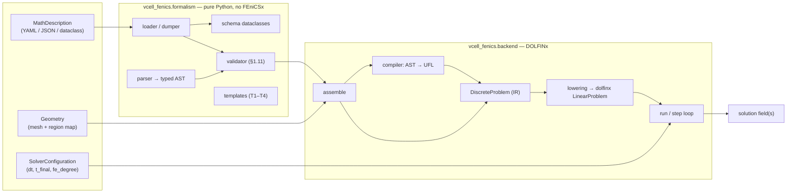
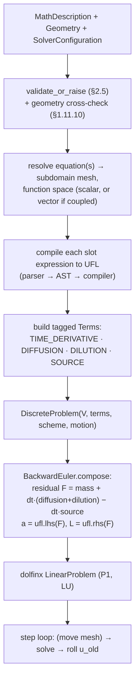
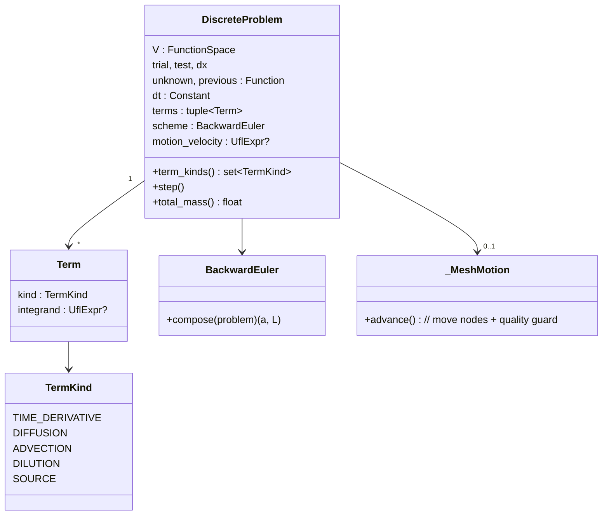
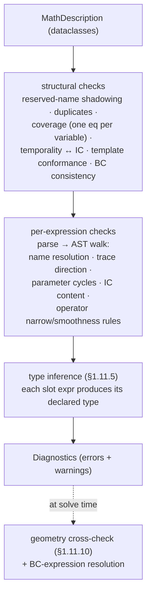

# vcell-fenics — architecture

> **Documentation review (2026-10-08):** See the [documentation map](README.md) and
> [discrepancy register](reviews/2026-10-08-documentation-discrepancies.md) for distinctions
> between historical plans and current implementation. New modeling discussion lives in the
> [cell-mechanics workspace](modeling/cell-mechanics/README.md).

How the code is organised and how a model flows from text to a solve. Diagrams
are [Mermaid](https://mermaid.js.org/) (renders on GitHub and most viewers). For
the *why*, see `docs/decisions/` (ADR 004 = the DiscreteProblem IR, ADR 005 =
typing) and the spec `docs/modeling/declarative-formalism.md`. For a gentler
intro see [`overview.md`](overview.md).

## Two layers

The code splits cleanly in two, and the boundary is load-bearing: **the
`formalism` layer is pure-Python with no FEniCSx dependency** (it only parses and
validates), and **DOLFINx enters only in the `backend` layer**. A different
backend (finite volume, a VCell wrapper) would reuse `formalism` unchanged.

## The translation pipeline

The heart of the backend is `AST → UFL → DiscreteProblem → lowering → dolfinx`
(ADR 004). The `DiscreteProblem` IR is the FEniCSx-backend-internal representation
of one (possibly coupled) solve — it makes the assembly decisions explicit and
testable, rather than burying them in imperative assembly code.

Why `lhs`/`rhs`: building the residual `F` and letting UFL split it means a
`source` *linear in the unknowns* — including cross-variable coupling — lands in
the implicit bilinear form automatically, with no per-term bookkeeping.

## The DiscreteProblem IR

A `DiscreteProblem` carries a function space, the solver state (`unknown`,
`previous`), a closed enum of **tagged terms** (each a UFL integrand), a **time
scheme**, and optional **prescribed motion**. Lowering happens once at
construction; `step()` advances it.

Because the terms are tagged and the assembly assumptions are explicit, a test
can assert *structure* with no solve — e.g. a static membrane has
`{TIME_DERIVATIVE, DIFFUSION}` while a moving one gains `DILUTION`. Correctness is
verified in layers: IR structure → compiler↔UFL equivalence → operator invariants
(`K·1 ≈ 0`, `A·1 = M·1`) → analytical/manufactured solutions.

## Validation flow

Validation runs on the parsed dataclass tree before any FEniCSx work. The
geometry cross-check and BC-expression contents are deferred to the backend
boundary because they need a concrete `Geometry`.

## Coupled multi-species assembly

Several equations sharing a subdomain become **one solve over a vector space**
(component k ↔ equation k). Each equation's terms use its component trial/test; a
`source` is compiled with every variable bound to its component trial, so
cross-variable coupling becomes off-diagonal blocks the `lhs`/`rhs` split
resolves. This is how the §1.4.5 two-species model runs as a single backward-Euler
step. (Equations spanning *different* subdomains — bulk↔surface `trace` coupling —
are deferred.)

## Module map

| Module | Responsibility |
|---|---|
| `formalism/schema.py` | frozen dataclasses for the MathDescription (the in-memory model) |
| `formalism/loader.py`, `dumper.py` | YAML/JSON ↔ dataclasses, structural well-formedness |
| `formalism/expr.py`, `parser.py` | typed expression AST + hand-written recursive-descent parser |
| `formalism/validator.py` | the §2.5 validation pass (most of §1.11) |
| `formalism/templates.py`, `vocabulary.py` | T1–T4 slot specs; reserved-name / function vocabulary |
| `backend/compiler.py` | expression AST → UFL (`CompileContext` binds names to UFL objects) |
| `backend/discrete.py` | `DiscreteProblem` IR, `BackwardEuler` lowering, `_MeshMotion`, mesh-quality guard |
| `backend/geometry.py` | `Geometry` adapter, name registry, §1.11.10 cross-check, disk builders |
| `backend/assemble.py` | MathDescription + Geometry → `DiscreteProblem` (scalar or coupled) |
| `backend/solver.py` | `SolverConfiguration` + the `run` driver |
| `backend/_typing.py` | the one irreducible `Any` alias (`UflExpr`); real DOLFINx/UFL types used directly elsewhere |

## Key design decisions (ADRs)

- **ADR 004** — the `DiscreteProblem` IR: semi-discrete residual (tagged terms +
  separate time scheme), FEniCSx-backend-internal, UFL as the expression IR, the
  build-once + per-step lifecycle, monolithic-linear coupling.
- **ADR 005** — use the FEniCSx stack's real (`py.typed`) types instead of
  `follow_imports = "skip"`, with `untyped_calls_exclude` for the unannotated-call
  noise.
- **001–003** — Pixi + pyproject, DOLFINx 0.10 pin, MPICH (not OpenMPI).
