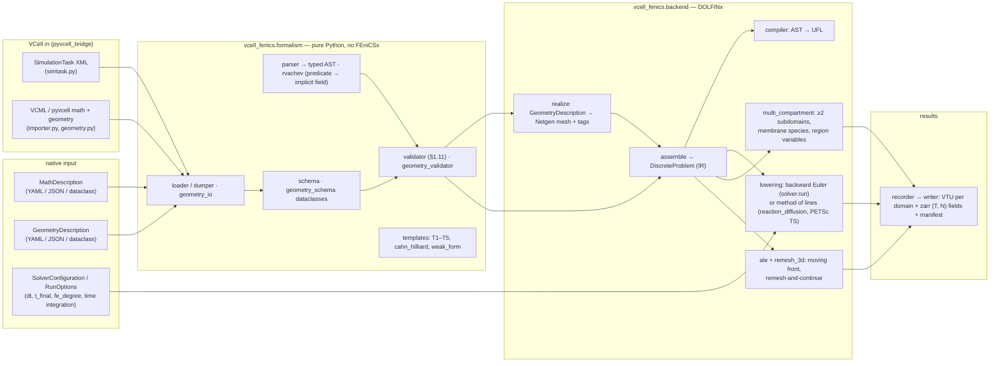
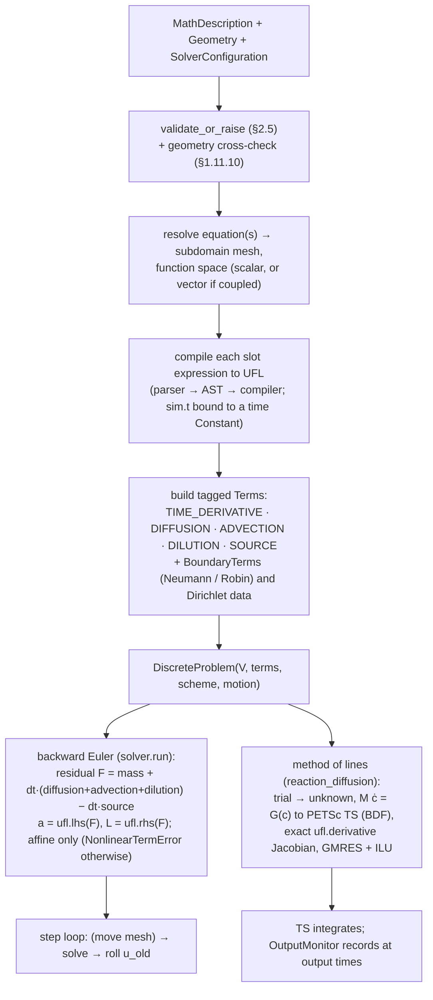
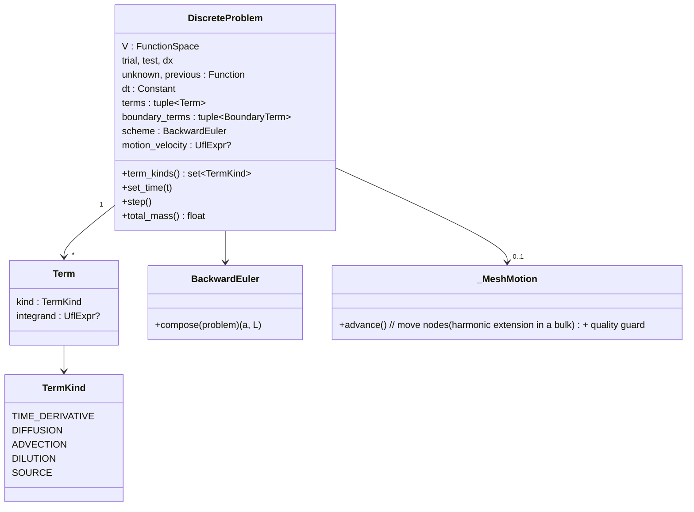
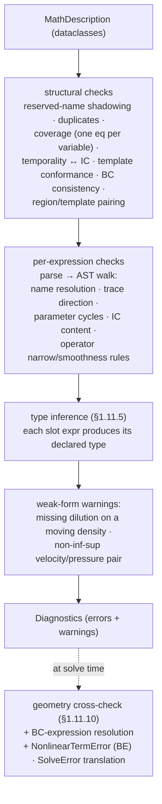

# vcell-fenics — architecture

> **Documentation review (2026-10-08):** See the [documentation map](README.md) and
> [discrepancy register](reviews/2026-10-08-documentation-discrepancies.md) for distinctions
> between historical plans and current implementation. New modeling discussion lives in the
> [cell-mechanics workspace](modeling/cell-mechanics/README.md).

How the code is organised and how a model flows from text to a solve. Diagrams
are [Mermaid](https://mermaid.js.org/) (renders on GitHub and most viewers). For
the *why*, see `docs/decisions/` (ADR 004 = the DiscreteProblem IR, ADR 005 =
typing, ADR 011 = the VCell solver contract) and the spec
`docs/modeling/declarative-formalism.md`. For a gentler intro see
[`overview.md`](overview.md). Module map and diagrams are current as of 2026-10-08.

## Two layers, and the VCell seams around them

The code splits cleanly in two, and the boundary is load-bearing: **the
`formalism` layer is pure-Python with no FEniCSx dependency** (it only parses and
validates), and **DOLFINx enters only in the `backend` layer**. A different
backend (finite volume, a VCell wrapper) would reuse `formalism` unchanged. Around them sit the VCell
seams: `pyvcell_bridge` turns VCell documents into the two formalism artifacts, and `results` writes
the bundle VCell's field viewer and pyvcell read.

`runner.run_model` chooses among the three backend paths from the model, not from a flag: one
subdomain → `assemble` + backward Euler or method of lines; two or more subdomains with equations →
`multi_compartment`; a moving subdomain → `ale` with backward Euler. Everything else in `backend/` is a
driver with its own Python entry point (listed in the module map) that the runner does not reach.

## The translation pipeline (single mesh)

The heart of the backend is `AST → UFL → DiscreteProblem → lowering → dolfinx`
(ADR 004). The `DiscreteProblem` IR is the FEniCSx-backend-internal representation
of one (possibly coupled) solve — it makes the assembly decisions explicit and
testable, rather than burying them in imperative assembly code. This is the single-mesh path; the
multi-compartment and ALE paths reuse `assemble`'s terms and lowering per block / per segment.

Why `lhs`/`rhs`: building the residual `F` and letting UFL split it means a
`source` *linear in the unknowns* — including cross-variable coupling — lands in
the implicit bilinear form automatically, with no per-term bookkeeping. A nonlinear source cannot be
split, so backward Euler refuses it by name (`diagnostics.NonlinearTermError`) and the method of lines
takes it as a genuine nonlinear residual.

## The DiscreteProblem IR

A `DiscreteProblem` carries a function space, the solver state (`unknown`,
`previous`), a closed enum of **tagged terms** (each a UFL integrand), boundary terms, a **time
scheme**, and optional **prescribed motion**. Lowering happens once at
construction (lazily for the backward-Euler `LinearProblem`, so a nonlinear model can still be
assembled for the method of lines); `step()` advances it.

Because the terms are tagged and the assembly assumptions are explicit, a test
can assert *structure* with no solve — e.g. a static membrane has
`{TIME_DERIVATIVE, DIFFUSION}` while a moving one gains `DILUTION`. On a moving mesh the backward-Euler
scheme drops the explicit `DILUTION` term and conserves through the swept-volume (conservative) time
term instead; the `ADVECTION` term keeps the drift's own divergence (ADR 009). Correctness is
verified in layers: IR structure → compiler↔UFL equivalence → operator invariants
(`K·1 ≈ 0`, `A·1 = M·1`) → analytical / manufactured solutions (`tests/`, `mms/`).

## Validation flow

Validation runs on the parsed dataclass tree before any FEniCSx work. The
geometry cross-check and BC-expression contents are deferred to the backend
boundary because they need a concrete `Geometry`. Runtime failures on the single-mesh paths are
translated into model-level messages by `backend/diagnostics.py` (a non-finite residual at the initial
condition localised to a term; a `TS` or linear-step failure named with its likely cause); the
multi-compartment and interface-coupled solvers do not yet route through it.

## Coupled multi-species assembly

Several equations sharing a subdomain become **one solve over a vector space**
(component k ↔ equation k). Each equation's terms use its component trial/test; a
`source` is compiled with every variable bound to its component trial, so
cross-variable coupling becomes off-diagonal blocks the `lhs`/`rhs` split
resolves. This is how the §1.4.5 two-species model runs as a single backward-Euler
step. Equations spanning *different* subdomains take one of two block solvers: `coupled.py` for one
bulk and the surface on its boundary (`trace(·)` coupling, DOLFINx `entity_maps`), and
`multi_compartment.py` for any number of compartments and membranes (one scalar P1 block per species
per region, a Real per region variable, each membrane coupling only its two sides through side-masked
traces; matrix-free Newton when membrane species are present).

## Module map

**Top level**

| Module | Responsibility |
|---|---|
| `cli.py` | argv + loading: `--simtask`, `--vcml`, `--math`/`--geometry`, discretisation and output flags, the VCell status flags; exit codes 0 / 2 (model or usage error) / 1 (crash) / 143 (SIGTERM) |
| `runner.py` | `run_model`: picks the single-mesh, multi-compartment or moving path from the model; writes the bundle and `provenance/` |
| `status.py` | the VCell status protocol (ADR 011 §4): `[[[progress:<phase>:NN%]]]` on stdout or REST WorkerEvents |
| `viz.py` | PyVista in-process and XDMF (ParaView) helpers |

**`formalism/` — pure Python**

| Module | Responsibility |
|---|---|
| `schema.py` | frozen dataclasses for the MathDescription (the in-memory model) |
| `loader.py`, `dumper.py` | YAML/JSON ↔ dataclasses, structural well-formedness |
| `expr.py`, `parser.py` | typed expression AST + hand-written recursive-descent parser |
| `validator.py` | the §2.5 validation pass (most of §1.11), region/template pairing, weak-form dilution and inf-sup warnings |
| `templates.py`, `vocabulary.py` | slot specs for T1 `bulk_radv_diff`, T2 `surface_pde_with_dilution`, T3 `algebraic_constraint`, T4 `lumped_ode`, T5 `region_ode`, `cahn_hilliard`; the namespaced reserved names (ADR 006) |
| `geometry_schema.py`, `geometry_io.py`, `geometry_validator.py` | the GeometryDescription (ADR 007): subvolumes, surface classes, named faces; its carriers and checks |
| `rvachev.py` | lowers an analytic subvolume's boolean predicate to a Rvachev implicit function |

**`backend/` — DOLFINx**

| Module | Responsibility |
|---|---|
| `compiler.py` | expression AST → UFL (`CompileContext` binds names, `sim.t`, `geom.*` to UFL objects) |
| `discrete.py` | `DiscreteProblem` IR, `BackwardEuler` lowering (conservative time term on a moving mesh), `_MeshMotion` + mesh-quality guard |
| `assemble.py` | MathDescription + Geometry → `DiscreteProblem` (scalar or coupled); BCs; `rebuild_on_mesh` after a remesh |
| `equations.py` | template normalisations the solvers share (spatial T4 as a transport-free field) |
| `geometry.py` | `Geometry` adapter, name registry, §1.11.10 cross-check, the bundled disk / box / nested builders |
| `realize.py`, `implicit_fields.py` | GeometryDescription → Netgen mesh + region / membrane / face tags (analytic via marched implicit fields, image via the label field) |
| `labels.py`, `label_surfaces.py` | image geometries (ADR 012): the smoothed label field; SurfaceNets boundaries with box-face sentinels |
| `solver.py` | `SolverConfiguration` + the backward-Euler `run` driver |
| `reaction_diffusion.py`, `output_times.py`, `linear_solvers.py` | method of lines on PETSc `TS` (fixed, strided and moving variants); recording at output times without perturbing the steps; rank-count-safe preconditioners (GMRES + ILU default) |
| `diagnostics.py` | `SolveError`, `NonlinearTermError`, preflight and solver-failure messages |
| `multi_compartment.py` | the multi-compartment solver: `realize_multi_compartment` (a submesh per compartment and membrane) and `integrate_multi_compartment` — any number of compartments and membranes, membrane species, region variables |
| `ale.py`, `remesh_3d.py` | the ALE remesh-and-continue driver (2D membrane, 2D bulk, 3D bulk); the 3D re-tetrahedralisation with its fallback ladder and exact-volume restore |
| `coupled.py` | one bulk + one surface, `trace(·)`-coupled through `assemble()` (§1.6.6) |
| `interface_coupled.py` | the older two-compartment (`integrate_interface_coupled`) and two-compartment-plus-membrane (`integrate_membrane_coupled`) solvers, backward Euler and method of lines |
| `weakform.py`, `unknown_motion.py` | the weak-form escape hatch; mechanics-driven membrane motion with the projected mean-curvature vector |
| `stokes.py`, `stokes_hdiv.py`, `slip.py`, `multiphase.py`, `fsi.py` | incompressible Stokes (Taylor–Hood; H(div) with strong normal BC), Nitsche normal slip, the two-phase overdamped mixture, the dynamic FSI loops with co-moving species |
| `cahn_hilliard.py` | resolved diffuse-interface Cahn–Hilliard (mixed `(φ, μ)`, convex splitting, Newton) |
| `_typing.py` | the one irreducible `Any` alias (`UflExpr`); real DOLFINx/UFL types used directly elsewhere |

**`core/` — approach-agnostic kernels (NumPy) and their DOLFINx bridges**

| Module | Responsibility |
|---|---|
| `surface_remap.py`, `surface_remap_mesh.py`, `surface_remap_trace.py` | conservative surface-density remap (1D supermesh), its `Function` bridge, the Approach-A bulk-trace correction |
| `bulk_remap.py`, `bulk_remap_mesh.py` | conservative 2D bulk remap (supermesh); the 3D non-matching interpolation with a global mass correction |
| `region_remesh_netgen.py` | the Netgen region remesher (deformed polygon → fresh mesh); the only mesher in `src/` (ADR 008) |
| `bgn_curve.py`, `bgn_curve_mesh.py` | BGN tangential mesh redistribution for a curvature-driven membrane |

**`pyvcell_bridge/` — VCell in** (pyvcell's pure-Pydantic data model only)

| Module | Responsibility |
|---|---|
| `simtask.py` | the SimulationTask XML (ADR 011): identity, settings precedence, refusals (`check_supported`), front velocities, FastSystem detection |
| `importer.py`, `expression.py`, `inlining.py`, `frame.py` | VCell MathDescription → formalism (doc §2.6): equations, BCs, membrane fluxes, region variables, moving fronts; expression translation; function inlining; coordinate-frame normalisation |
| `geometry.py` | VCell Geometry → GeometryDescription (analytic, CSG, image, compartmental) |
| `overrides.py` | MathOverrides and parameter scans, resolved exactly as VCell does |

**`results/` — the bundle (ADR 010)**

| Module | Responsibility |
|---|---|
| `schema.py`, `writer.py`, `reader.py` | manifest schema 1; the atomic, MPI-collective writer; the reference reader |
| `recorder.py`, `gather.py`, `vtu.py` | P1 interpolation + statistics per output time; rank-independent point order; VTU I/O pinned to VCell's `VtuGridParser` |
| `export.py`, `__main__.py` | ParaView export (PVD / XDMF); the `python -m vcell_fenics.results` summary |

## Key design decisions (ADRs)

- **ADR 004** — the `DiscreteProblem` IR: semi-discrete residual (tagged terms +
  separate time scheme), FEniCSx-backend-internal, UFL as the expression IR, the
  build-once + per-step lifecycle, monolithic-linear coupling.
- **ADR 005** — use the FEniCSx stack's real (`py.typed`) types instead of
  `follow_imports = "skip"`, with `untyped_calls_exclude` for the unannotated-call
  noise.
- **ADR 006** — namespaced built-ins (`geom.*`, `sim.*`).
- **ADR 007 / 008 / 012** — the GeometryDescription is the source of truth; Netgen (LGPL) is the
  mesher, gmsh dev-only; image geometries are realized through a smoothed label field.
- **ADR 009** — the compressible relative-advection dilution; FSI's inline transport stays separate.
- **ADR 010 / 011** — the VTU + zarr results bundle; the VCell solver contract and status protocol.
- **001–003** — Pixi + pyproject, DOLFINx 0.10 pin, MPICH (not OpenMPI).
